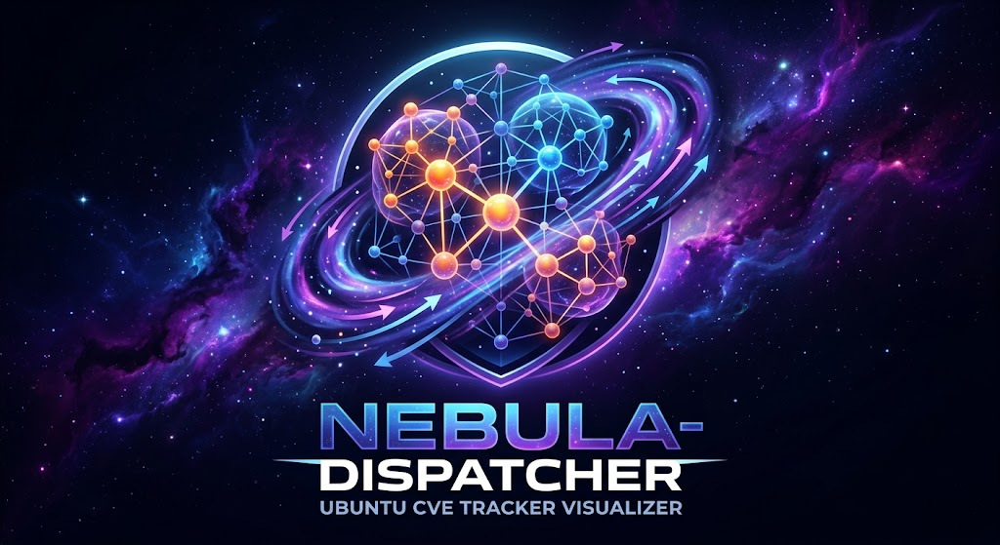

# Nebula Dispatcher - Ubuntu CVE Tracker Visualizer



A real-time 3D interactive visualization of Ubuntu CVE Tracker vulnerability data. Packages appear as glowing planets in a spring-layout galaxy computed server-side with NetworkX, and CVEs bloom as orbiting moons when you focus on a package — shared vulnerabilities form the gravitational links between them.


## Features

- **3D Spring-Layout Galaxy** — NetworkX computes package positions server-side; packages render as instanced glowing planets in Three.js with bloom post-processing
- **CVE Moon Orbits** — Click a package to focus: everything else fades away and its CVEs bloom as orbiting child nodes with slow rotation animation and orbit connector lines
- **Component Tabs** — Switch between `main`, `universe`, `multiverse`, `restricted`, `ESM Apps`, and `ESM Infra` Ubuntu components
- **Composite Scoring & Severity Tiers** — Each CVE is scored: `0.30×priority + 0.35×CVSS + 0.20×KEV + 0.15×recency`, then classified into composite severity tiers (critical / high / medium / low / negligible) for filtering
- **Severity Filters** — Toggle severity tiers and CISA KEV-only mode via chip filters in the controls panel
- **Live Auto-Refresh** — A background watcher thread monitors UCT `active/` file mtimes and notifies the browser when new data is available
- **Lazy CVE Loading** — CVEs are fetched per-package on demand via `/api/cves/{component}/{package}` for fast initial page load
- **Flight Mode** — Press `F` to enter first-person WASD flight mode; Space/Shift for vertical movement
- **Search & Focus** — Filter the graph by package name; click in the sidebar to smoothly fly the camera to any node
- **Hover Tooltips** — Hover a package or CVE to see a tooltip with key stats including severity tier
- **Detail Panel** — Click a CVE to see severity, CVSS, CISA KEV status, affected releases, and per-release package status
- **Interactive Controls** — Adjust link opacity, node scale, and reset the camera view in real time

## Prerequisites

- Python 3.8+
- [NetworkX](https://networkx.org/) (`apt install python3-networkx`)
- [SciPy](https://scipy.org/) (`apt install python3-scipy`)
- A local clone of the [Ubuntu CVE Tracker](https://git.launchpad.net/ubuntu-cve-tracker/) repository

## Usage

```bash
# Set the UCT path once (optional — can also use --uct-path)
export UCT=/path/to/ubuntu-cve-tracker

python3 uct_server.py [--port 8080] [--watch-interval 30]
```

| Flag | Default | Description |
|---|---|---|
| `--uct-path` | `$UCT` env var or `~/git-pulls/ubuntu-cve-tracker` | Path to the ubuntu-cve-tracker repo |
| `--port` | `8080` | HTTP port to serve the viewer on |
| `--host` | `127.0.0.1` | Bind address (use `0.0.0.0` to expose to network) |
| `--watch-interval` | `30` | Seconds between filesystem sync checks |

Then open [http://localhost:8080](http://localhost:8080) in a modern browser.

## API Endpoints

| Endpoint | Description |
|---|---|
| `GET /` | Serves the single-page viewer |
| `GET /api/graph-lite/{component}` | Packages + links (no CVEs) for fast initial load |
| `GET /api/graph/{component}` | Full graph including CVE positions |
| `GET /api/cves/{component}/{package}` | CVEs for a single package (lazy-loaded on focus) |
| `GET /api/status` | Server status, version, CVE counts per component |

## How It Works

1. **Data Loading** — On startup, the server parses every `CVE-*` file in the UCT `active/` directory using a built-in CVE file parser (no longer depends on `cve_lib`), and reads `subprojects.json` for active releases
2. **Component Mapping** — Package-to-component mapping is built by downloading `Sources.gz` from `archive.ubuntu.com` and `esm.ubuntu.com` for each active release. Standard releases map packages to their archive section (`main`/`universe`/etc). ESM releases (`esm-infra`, `esm-apps`) add the ESM component. Results are cached in `.cache/sources_gz/` for fast subsequent runs
3. **Layout Computation** — NetworkX `spring_layout` (3D) computes package positions server-side. Isolated nodes are placed on a surrounding sphere. CVE moons are arranged in a Fibonacci sphere distribution around their parent package
4. **Composite Weight** — Each CVE is scored: `0.30×priority + 0.35×CVSS + 0.20×KEV + 0.15×recency` — this drives node size, link thickness, and severity tier classification
5. **Live Updates** — A background watcher thread monitors file mtimes in `active/`, incrementally re-parses changed CVEs, and bumps a version counter that the browser polls every 30 seconds
6. **Rendering** — The single-page viewer uses raw Three.js with `InstancedMesh` for high-performance rendering, `UnrealBloomPass` for glow effects, a procedural starfield, and HTML label overlays projected from 3D to screen coordinates

## Priority Colors

| Priority | Color |
|---|---|
| Critical | Red |
| High | Orange |
| Medium | Yellow |
| Low | Green |
| Negligible | Grey |
| Untriaged | Blue |
| CISA KEV | Purple glow |

## License

This project is licensed under the [GNU General Public License v3.0](LICENSE).
